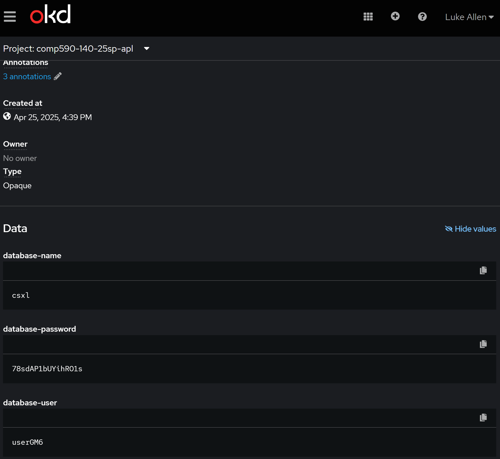
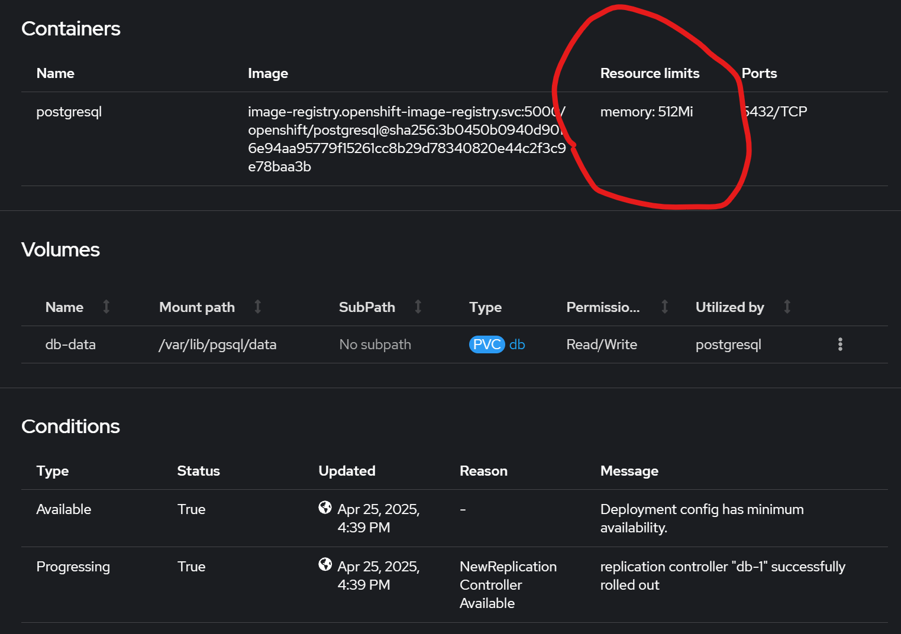
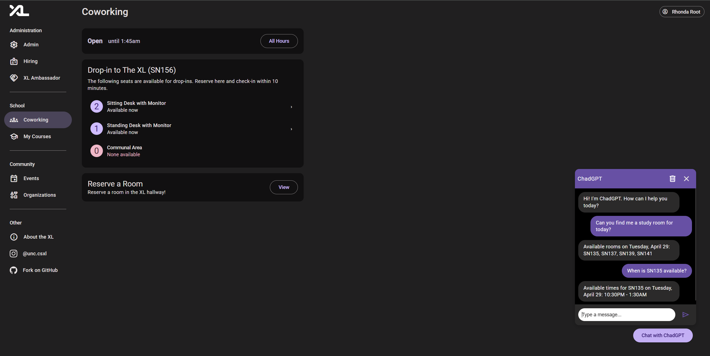
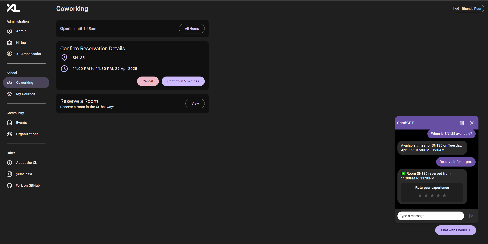

# ChadGPT - Chatbot Room Reservation Feature

## Authors

- [Luke Allen](https://github.com/LukeAllen13)
- [Ethan Bonsall](https://github.com/ethanbonsall)
- [Nicholas Cope](https://github.com/nicholas-cope)
- [Ryan Krasinski](https://github.com/RunXPS)

## Overview

This feature enables users to interact with a chatbot (ChadGPT) to view and reserve study rooms through natural language. The chatbot integrates with OpenAI's function calling and our internal FastAPI reservation system.

The system supports:

- Checking available rooms on a given date
- Viewing available time slots for a specific room
- Booking a room for a time range if available
- Updating times for an existing reservation
- Cancelling reservations

This documentation provides a walkthrough of the implementation across the frontend, backend, database, and AI integration layers.

## Frontend

The chatbot is implemented as an Angular widget component called `ChatWidget`, rendered with a toggle button that opens a chat window pane.

Located in: `frontend/src/app/components/chat-widget`

### Main Files

- `chat-widget.widget.ts`: Contains state and logic
- `chat-widget.widget.html`: Renders the UI
- `chat-widget.widget.css`: Styles the component

### Key Features

- Toggling chat open/close
- LocalStorage-based message persistence
- Smooth auto-scrolling
- Trash button to clear chat history
- Star rating system upon successful reservations for feedback
- Upon user messages, sends POST requests to `/api/chat`

## Backend

Located in: `backend/api/chat.py`

### Key Dependencies

- `OpenAIService` – handles GPT calls and function parsing
- `ReservationService` – checks room availability and performs bookings
- `registered_user` – injects the user object from JWT authentication

### Endpoint

```
POST /api/chat
```

### Request Body

```json
{
  "message": "Can you find me a room today?",
  "history": [
    {
      "role": "user",
      "content": "Hello!"
    }
  ]
}
```

### Response (Example)

```json
{
  "response": "Available rooms on Friday, April 11: SN135, SN137"
}
```

### Chat Flow

- Parses natural language input
- Uses OpenAI function calling to determine the user's intent
- Executes functions like `get_available_rooms`, `get_room_availability`, or `reserve_room`
- Formats the results back into a plain language response

## Supported Functions

The following table lists all functions defined for the AI assistant to interpret user intent and map it to backend logic:

| Function Name         | Description                                                             | Parameters                                                                         |
| --------------------- | ----------------------------------------------------------------------- | ---------------------------------------------------------------------------------- |
| get_available_rooms   | Check available rooms on a specific date                                | `date` (string, date)                                                              |
| reserve_room          | Reserve a room for a user                                               | `room_id` (string), `start` (string, date-time), `end` (string, date-time)         |
| get_room_availability | Get the available hours for a specific room on a given date             | `room_id` (string), `date` (string, date)                                          |
| get_user_reservations | Get a list of all current and upcoming reservations for the user        | —                                                                                  |
| get_reservation       | Get a reservation by its ID                                             | `reservation_id` (integer)                                                         |
| cancel_reservation    | Cancel an existing reservation by its ID                                | `reservation_id` (integer)                                                         |
| update_reservation    | Change the start and end time of an existing reservation                | `reservation_id` (integer), `start` (string, date-time), `end` (string, date-time) |
| change_reservation    | Change a reservation by canceling the original and reserving a new time | `reservation_id` (integer), `start` (string, date-time), `end` (string, date-time) |

## AI Integration

We use the OpenAI GPT model with function calling enabled.

### Prompting Strategy

- The system prompt defines behavior: today's date, hour constraints, max duration logic
- GPT is instructed to prefer available time ranges after the current time
- Model uses message history to infer intent ("available rooms" vs "available times")

## Database

We created an PostgreSQL database named 'db' in OKD and connected it to our final-project pod.

Ensured that memory usage by the database was compatible with the usage from other pods (our ex01 and prior secrets possibly created)

Created a Chatbot entity to allow the admin page to connect to the database and pull message data from the user.

## Admin Room Availability Toggling

Created a widget with a table displaying each room and its live availability, with connections to RoomService and AdminDataService. Backend connection gives 200, but does not work when attempting to integrate with the chatbot, as storage of availability wasn't figured out.

## Admin Chat Data

## End User Experience

Here’s an example flow of a user making a room reservation on the frontend:



